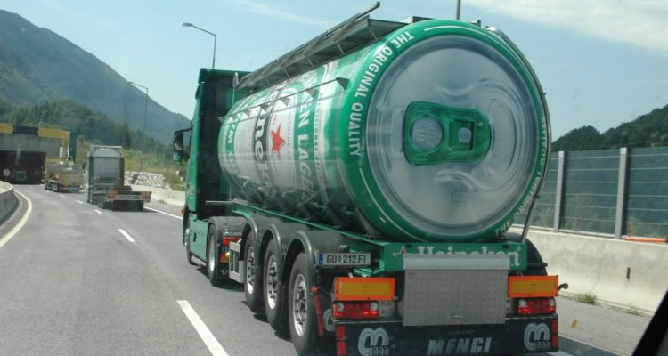

Title: Líbeznice budují pivovod
Description: Programming comic strip, employers have often very high expectations from software developer employees  
Published: 30/9/2018
Image: pipeline.jpg
---

V květnu by konečně měly započíst dlouho očekávané připravy na obecní pivovod, tedy potrubní komunikace plošně distribující zlatavý mok po celé naši metropoli.  

Nápad se v hlavách našich čelních představitelů zrodil už před mnoha lety, ale tepreve teď začne konečně samotná realizace. Líbeznice se tak zařadí k dalším metropolím, jako jsou třeba Belgické Bruggy, či podobným projektům z Německa. 

V krátkém rozhovoru nám Prezident Kupka sdělil proč je realizace této klíčové páteřní sítě trochu opožděna. “Bylo potřeba získat potřebná povolení a samozřejmě by tento projekt nemohl vzniknout bez subvence ze strany EU, konkrétně z fondu rozvoje venkova”. 

Pan Prezident rovněž dementoval šířící se nepravdy, že už by dopředu bez veřejné soutěže uzavřeli desetiletý kontrakt s pivovarem Argus.  

“Ten kontrakt jsme ve skutečnosti uzavřeli, ale Argus budeme odebírat pouze jako kapalinu určenou k čitění trubek. Dodavatele na pivo pro samotnou konzumaci budeme soutěžit jednou ročně. Dlouhodobou spolupráci s firmou Argus jsme zvolili hlavně proto, že podali levnější nabídku než Vodárny a kanalizace. Navíc Argus jako voda vypadá a podobně i chutná. Pro samotou dodávku piva budeme soutěžit jedině pivovary, co to s výrobou piva myslí vážně” 

*Cistérny už na Líbeznických dálnicích neuvidíme, vytlačí je nový pivovod*
